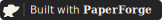

# PaperForge visual identity

The mark fuses a sheet of paper with an anvil: the lifted page corner continues
into the anvil horn, so the two ideas read as one silhouette rather than two
stacked icons. The system is deliberately one-color and uses cut-out geometry;
it survives grayscale printing and works without a white box on arbitrary
backgrounds.

The previous identity is preserved intact under [`archive/claude-v1/`](archive/claude-v1/).

## Files

| file | use |
|---|---|
| `paperforge-mark.svg` | primary charcoal mark for light backgrounds |
| `paperforge-mark-dark.svg` | warm-white mark for dark backgrounds |
| `paperforge-mark-mono.svg` | one-color mark that inherits CSS `currentColor` |
| `paperforge-logo.svg` | horizontal mark and PaperForge wordmark |
| `paperforge-icon.svg` / `paperforge-icon-512.png` | square avatar and social icon |
| `paperforge-glyph.svg` | simplified small-size glyph or favicon source |
| `paperforge-badge.svg` | 162x20 “Built with PaperForge” link badge |
| `paperforge.tex` | TikZ mark and linked LaTeX colophon |

## Link back from a paper or project

Markdown:

```markdown
[](https://github.com/roed-math/paperforge)
```

HTML:

```html
<a href="https://github.com/roed-math/paperforge">
  
</a>
```

LaTeX:

```latex
\usepackage{tikz}
\usepackage{hyperref}
\input{paperforge.tex}
...
\PaperForgeColophon
```

For dark-mode-aware web embeds, select `paperforge-mark-dark.svg` when the
background is dark. Use `paperforge-mark-mono.svg` when the surrounding CSS
should control the mark color.
